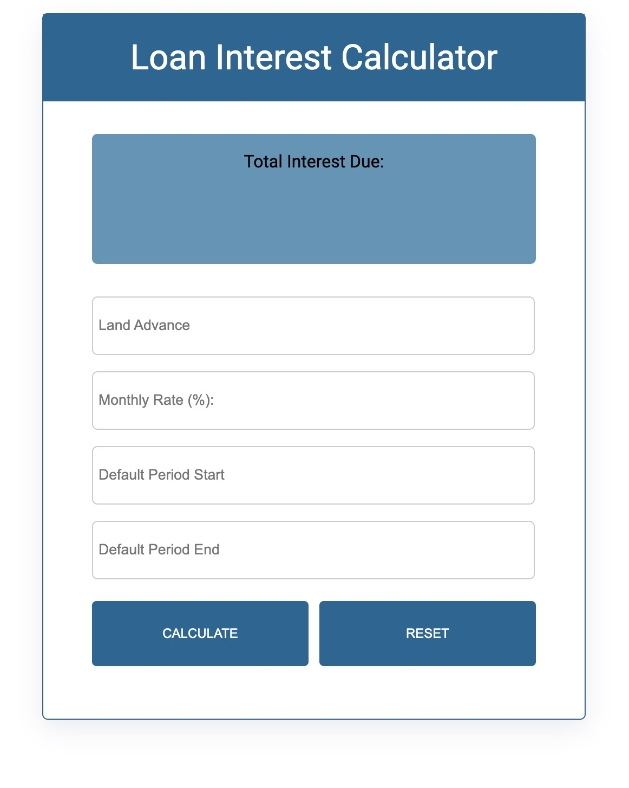

# Loan Interest Calculator 

This Loan Interest Calculator helps you determine the total interest owed on a loan at repayment. It considers factors like:

- Loan amount
- Interest rate
- Loan status (regular or defaulted)

### The challenge

Users should be able to:

- Users can enter the loan amount, interest rate, and loan status through a user-friendly form.
- The calculator calculates the total interest based on the entered information, including a penalty rate for defaulted loans.
- Users can view the calculated total interest amount.

### Built with

- Semantic HTML5 markup
- CSS
- Python 3
- [Flask](https://reactjs.org/) - Python framework 
- JavaScript

## Author

- Abdul Oketunde
